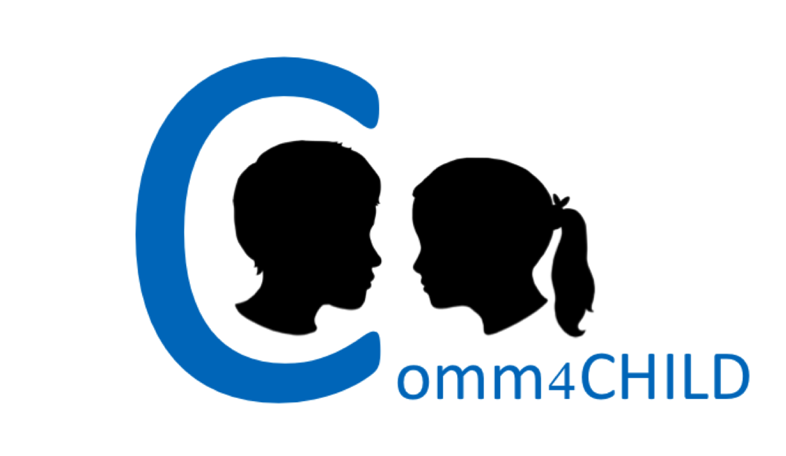
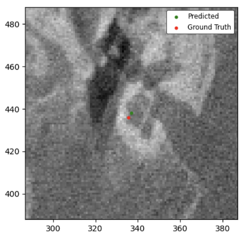
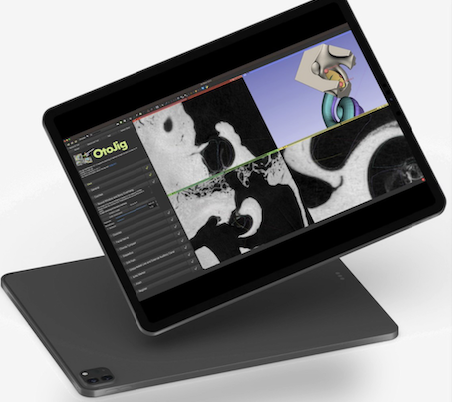

# Comm4CHILD ESR2 Software Release

<div align="center">
<h3> Automatic Landmark Localization in 3D Medical CT Images using deep-learning based neural networks</h3>
</div>


## Table of Contents

- [Project Description](#project-description) 
- [Installation](#installation)
  - [Prerequisites](#prerequisites)
  - [Setting Up the Environment](#setting-up-the-environment)
  - [Activate the work environment](#activate-the-work-environment)
- [Code explaination (Quick Tour)](#code-explaination-quick-tour)
- [Future Work](#future-work)
- [Authors](#authors)
- [Citation](#citation)
- [Contact](#contact)

## Project Description 

[Comm4CHILD](https://comm4child.ulb.be/) is a European project under the Marie Skłodowska-Curie grant agreement n°860755 within the European Union’s Horizon 2020 research and innovation program. This GitHub repository has been open sourced based on the research of Yifan Wang [ESR2](https://comm4child.ulb.be/2020/07/09/2-2/)'s project. The project aimed to design and apply a fully automated deep learning-based localization/segmentation pipeline capable of localizing/segmenting the cochlea structure in 3D CT scans. The host institution of ESR2 is [HörSys GmbH](https://preview.hoersys.de/en/research/). 

The open-source code released in May 2024 is based on the article: [Automatic Landmark Localization in 3D Medical CT Images: Few-Shot Learning through Optimized Data Pre-Processing and Network Design](https://doi.org/10.1145/3632047.3632048).

In that paper, we presented an automatic landmark localization algorithm with few-shot learning capability, designed for 3D CT scans. A four-class classification algorithm SMICNet trained with 2D sub-image patches has been implemented to identify/classify three anatomical landmarks of interest at the cochlea: “apex point”, “basal point”, “round window center”, and an additional class “background”. The algorithm then combined a sliding window approach using the trained classifier to scan the provided region of interest, generating a 3D probability map containing the predicted probabilities for each landmark to localize the 3 cochlea landmarks directly in the given 3D CT scan. There are 6 different models, trained with varying number CT volumes, ranging from 1 up to 11 CT volumes. 

A model trained with only five CT volumes achieves a performance (median weighted F1 scores for classification evaluation) of around 0.99 (apex), 0.985 (basal), 0.98 (round window center), 0.98 (background). By manually providing an initial point placed near the cochlea, the automatic localization for all three landmarks within the 3D CT volume was then accomplished using a sliding window approach. Compared to manually defined ground truth, the 5-volume-trained model attained an average Euclidean distance error (for localization evaluation) of 0.70 mm (apex), 1.15 mm (basal), and 0.84 mm (round window center) on 3D CT volumes (with image spacing 0.3 mm) from a test set. 

Future updates and additional deep learning-based algorithms will be released progressively, each building on the advancements of the previous versions to enhance the performance of the speed and accuracy further.

## Installation

### Prerequisites
- Conda 
- macOS or Windows:
  - On macOS: the code itself allows to activate m1 chip's Metal Performance Shaders (MPS) to boost the model inference/testing speed. 
  - On windows: the code itself allows to activate the local devices's GPU, with more advanced GPUs enabled, the model inference/testing will be more rapid.

### Setting Up the Environment

**on macOS** (mps GPU built in)

* Download *requirements_mac.txt*, *setup_env_mac.sh* under directory system username.

* run this command in your terminal.

  ```shell
  bash setup_env_mac.sh
  ```

The environment is installed when in the terminal shows the "Environment setup is complete". 

**On Windows** (Release in May 2024: not completely configured)

* Download *requirements_windows.txt*, *setup_env_windows.sh* under directory system username.

* Run this command in your terminal.

  ```shell
  bash setup_env_windows.sh
  ```

The environment is installed when in the terminal shows the "Environment setup is complete". 

### Activate the work environment

1. In the terminal: activate the vitural environment installed.
    ```sh
    conda activate SMICNet_env   
    ```
2. In the terminal: open the jupyter notebook. 
    ```sh
    jupyter notebook
    ```
3. Open and run `SW_application_opensource.ipynb` file in the repository. Choose the kernel  *`SMICNet_env`*

## Code explaination (Quick Tour)

* Run `SW_application_opensource.ipynb`.
* The author provided a volumetric 3D CT data *0002_toload* as well as the manually defined ground truth of the cochlea structure, from both left and right side in *Cochlea.fcsv*. 
* **Code structure:** 
  * Data_generator.py: Data loading of training and testing data (image & label) generator for all 4 classes, with different data augmentation techiniques. 
  * SMICNet.py: Architecture of SMICNet. 
  * Training.py : Traning function to train locally a network from scratch with training data genrerated from the provided volume 0002. 
  * **`SW_application_opensource.ipynb`:** To test model inference performance with the pre-trained network
    * *Section 1: Import libraries*: Import libraries. 
    * *Section 2: Load volumes:* Load the provided data for quick testing or training. 
    * *Section 3: Start the training on the fly*:  Optional, activate it to when need to train a local network from scratch
    * *Section 4: Model application/inference*: It consists of two evaluation components: classification and localization. Different training models can be loaded to compare the performance of both. 
      * Load different model trained with different quantity volumes: Choose different provided model for the evaluation.  
      * Classification performance: 
        * Evaluation of images from generator: Generate images and labels of both cochla and background classes from *Data_augmentation_Generator*. The quantity of augmented data can be adjusted by changing variables *steps1,steps2,steps3* when defining train_data_gen11. 
        * quick look which class the loaded 2D sub image belongs to: Quick lookclassification output on individual 2D sub-image. 
        * Optional: CNN layers visualization: To see each layer's features extraction information. 
        * Optional: F1 score generation based on 2D images, with different model: To generate Weighted F1 score of different model trained with different quantity of volumes. 
        * Optional: load author provided F1 score CSV, to compare classification performance among different networks : To quicly see the df_f1scores of different provided trained model. 
      * Distance: run on the 3D volume 
        * **Sliding Window process**: to generate probability map, here needs to wait some mintutes and the generated probability map is large size.
        * **load trained probability map for calcuate the landamrk coordinates: for 3 classes**: to load the probability map generated. 
        * predicted landmark localization: calculate the predicted coordinates by center mass of the probability map. 
        * distance calculation: with 0.3mm image spacing: to calculate the distance in mm between the predicted landmark and the ground truth. 
        * visualisation: compare with the ground truth landmark: Visualize the localization precision on the images. 

## Future Work 

In the foreseeable future, ESR2 plans, on a voluntary basis, to extend the research on fully automatic detection by developing a customized end-to-end real-time deep learning-based algorithm. This new approach, will be released in this GitHub repository, aims to achieve significantly more rapid inference speeds compared to SMICNet, while maintaining high precision in the localization of structures of interest in 3D volumetric medical CT scans. This work is planned to be integrated into the image-based planning software that runs on an iPad, which considered as the core business of [HörSys GmbH](https://preview.hoersys.de/en/research/) and [OtoJig GmbH](https://otojig.com/) (spin-off sister-company of HörSys GmbH). Moreover, it is aimed to later exploit the results by generalizing the training pipeline to allow for simultaneous training any number between 1 and N of different landmarks on different imaging modalities, including CT, Magnetic resonance imaging (MRI) and others. While currently is fixed to N=3 cochlear landmarks.

<div align="center">   </div>

## Authors

#### Yifan Wang

wang.yifan@hoersys.de, wang.yiyi0707@gmail.com. [HörSys GmbH](https://hoersys.de), Hannover Medical School, Germany

#### Thomas Lenarz

lenarz.thomas@mh-hannover.de. Department of Otolaryngology, Head & Neck Surgery, Hannover Medical School, Germany

#### Andrej Kral

kral.andrej@mh-hannover.de. Institute of AudioNeuroTechnology & Cluster of Excellence Hearing4all & Department of Experimental Otology, ENT Department, Hannover Medical School, Germany

#### Samuel John

john.samuel@hoersys.de. HörSys GmbH, Feodor-Lynen-Str. 35, 30625 Hannover, Germany;

## License

For this code, see [LICENSE.md](LICENSE.md).
The license does not apply to the vendored third party code: Pyrr, neuclid, volume, transformations.py. Please see the individual copyright statements in the respective files.

## Citation

If the work is interesting, you can cite like this! 

```bibtex
@inproceedings{10.1145/3632047.3632048,
author = {Wang, Yifan and Lenarz, Thomas and Kral, Andrej and John, Samuel},
title = {Automatic Landmark Localization in 3D Medical CT Images: Few-Shot Learning through Optimized Data Pre-Processing and Network Design},
year = {2024},
isbn = {9798400708152},
publisher = {Association for Computing Machinery},
address = {New York, NY, USA},
url = {https://doi.org/10.1145/3632047.3632048},
doi = {10.1145/3632047.3632048},
booktitle = {Proceedings of the 2023 10th International Conference on Bioinformatics Research and Applications},
pages = {1–7},
numpages = {7},
keywords = {Artificial neural network, Automatic landmark localization, CNN, Data augmentation, Medical image processing},

```


## Contact 

If any questions or collaborations, please reach out with the email listed above in the author section, thanks! 